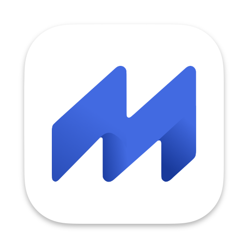
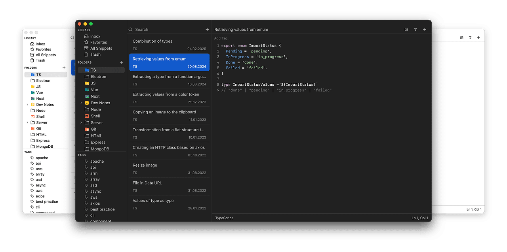
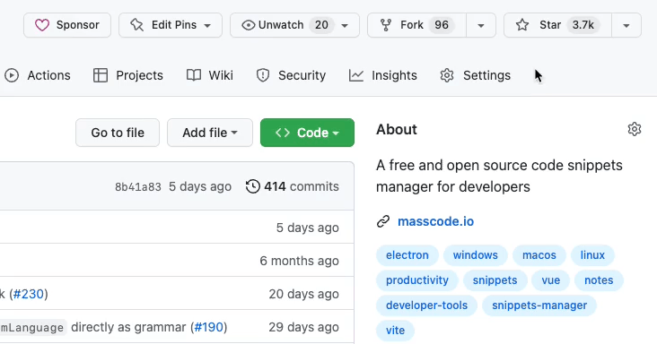

<p align="center">
  
</p>

<h1 align="center">massCode</h1>
<p align="center">
A free, open-source developer workspace.
</p>

<p align="center">
  <strong>Snippets, notes, calculations, and dev tools in one local-first app.</strong>
  <br>
  Your data stays on your machine as plain Markdown files.
</p>

<p align="center">
  
  
  
  
</p>

<p align="center">
  <a href="https://github.com/massCodeIO/massCode/releases">Download</a> &nbsp;|&nbsp;
  <a href="https://masscode.io/documentation/">Documentation</a> &nbsp;|&nbsp;
  <a href="https://github.com/massCodeIO/massCode/blob/master/CHANGELOG.md">Changelog</a>
</p>

<p align="center">
  Extensions:
  <a href="https://marketplace.visualstudio.com/items?itemName=AntonReshetov.masscode-assistant">VS Code</a> |
  <a href="https://www.raycast.com/antonreshetov/masscode">Raycast</a>
</p>

<br>

<p align="center">
  
</p>

<p align="center">
  <sub>Available for macOS, Windows, and Linux</sub>
</p>

<br>

<br>

## Support

massCode is free and open source. But building and maintaining a quality tool takes time. Your support helps keep development going and new features coming.

<div align="center">

[](https://opencollective.com/masscode)
[](https://paypal.me/antongithub)
[![Gumroad](https://img.shields.io/badge/donate-Gumroad-blue?style=popout&logo=)](https://antonreshetov.gumroad.com/l/masscode)
[![Polar](https://img.shields.io/badge/donate-Polar-blue?style=popout&logo=)](https://buy.polar.sh/polar_cl_bpDmjg079kfiAVtdtrtBwxyRXN6NK8B4Bvqdk2QXdx7)

</div>

<p align="center">
  <strong>SPONSORS</strong>
</p>

<p align="center">
  <a href="https://m.do.co/c/f2bb3bfab2e6">
    
  </a>
  &nbsp;
  <a href="https://mysigmail.com/?ref=github/massCodeIO">
    
  </a>
</p>

## About

Originally a snippet manager, massCode now brings together snippets, notes, calculations, and developer tools in one desktop app, so everyday work stays in one place.

## Features

### Code Snippets

Use massCode as a focused snippet workspace with multi-level folders, tags, and fragments for organizing reusable code across projects and languages.

- 160+ syntax grammars out of the box (600+ supported via `.tmLanguage`)
- Integrated [Prettier](https://prettier.io) for code formatting
- Real-time HTML & CSS preview for quick prototyping
- JSON Visualizer for exploring nested structures as interactive graphs
- Export snippets as polished images with customizable themes

### Notes

Write longer markdown documents right next to your snippets: project docs, drafts, research notes, and personal knowledge bases.

- Dashboard with activity overview, recent notes, top linked notes, and a notes graph preview
- Editor, Live Preview, and Preview modes
- Fullscreen notes graph for exploring internal links between notes
- Integrated [Mermaid](https://mermaid-js.github.io/mermaid/#) diagrams
- Mind maps generated from markdown heading structure
- Fullscreen presentation mode for demos and meetings
- Callout blocks and image embedding

### Math Notebook

A calculator-style notebook for natural-language calculations, conversions, and date math without leaving your workflow.

- Arithmetic, percentages, unit conversions, and date/time math
- 166+ fiat currencies, 21 cryptocurrencies with live exchange rates
- Variables, functions, and aggregates for quick iterative calculations
- Finance calculations (compound interest, ROI, loan repayment)

### Developer Tools

Built-in utilities for the small tasks that usually send you to a browser tab:

- **Compare:** JSON Diff
- **Text:** Case Converter, Slug Generator, URL Parser
- **Crypto:** Hash/HMAC Generator, Password Generator, UUID
- **Encoders:** URL, Base64, JSON to TOML/XML/YAML, Color Converter
- **Generators:** JSON Generator, Lorem Ipsum

## Markdown Vault

Your snippets and notes live as plain `.md` files on disk with frontmatter metadata, so the data stays readable and portable.

- **Git-friendly** - track changes and sync via any Git remote
- **Cloud sync** - works with iCloud, Dropbox, Google Drive, Syncthing
- **Live sync** - massCode watches the vault and picks up external changes in real time
- **No vendor lock-in** - your data is always yours

## Custom Themes

Customize the app UI and editor syntax highlighting with JSON theme files. Supports light and dark themes with live reload. See the [theme docs](https://masscode.io/documentation/themes.html).

## Build Locally

<details>
<summary>Instructions for building from source</summary>

### Prerequisites

- Node.js (>=20.16.0)
- pnpm (>= 9.0.0)

### Install Dependencies

```bash
pnpm install
```

### Build

To build for current platform:

```bash
pnpm build
```

To build for a specific platform:

```bash
pnpm build:mac    # macOS
pnpm build:win    # Windows
pnpm build:linux  # Linux
```

### Development

To run in development mode:

```bash
pnpm dev
```

</details>

## Troubleshooting

<details>
<summary>macOS: "massCode is damaged and can't be opened"</summary>

This is caused by macOS security settings. Fix it with:

**Option 1: System Settings (macOS 13+)**
1. Open **System Settings** -> **Privacy & Security**
2. Find "massCode" and click **Allow Anyway**

**Option 2: Terminal**
```bash
sudo xattr -r -d com.apple.quarantine /Applications/massCode.app
```

</details>

## Follow

- News and updates on [X](https://x.com/anton_reshetov)
- [Discussions](https://github.com/massCodeIO/massCode/discussions)



## License

[AGPL-3.0](https://github.com/massCodeIO/massCode/blob/master/LICENSE)

Copyright (c) 2019-present, [Anton Reshetov](https://github.com/antonreshetov).
