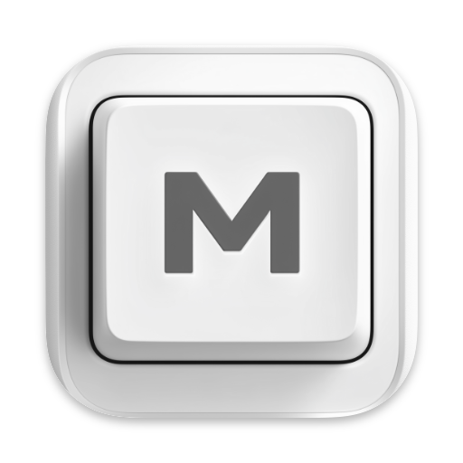

<p align="center">
  
</p>

<h1 align="center">massCode</h1>
<p align="center">
A free, open-source code snippet manager to create, organize, and instantly access your personal snippet library.
</p>

<p align="center">
  <strong>Built with Electron, Vue & Codemirror.</strong>
  <br>
  Inspired by applications like SnippetsLab and Quiver.
</p>

<p align="center">
  
  
  
</p>

<p align="center">
  <a href="https://github.com/massCodeIO/massCode/releases">Latest Release</a> |
  <a href="https://masscode.io/documentation/">Documentation</a> |
  <a href="https://github.com/massCodeIO/massCode/blob/master/CHANGELOG.md">Change Log</a>
</p>

<p align="center">
  Extensions:
  <a href="https://marketplace.visualstudio.com/items?itemName=AntonReshetov.masscode-assistant">VS Code</a> |
  <a href="https://www.raycast.com/antonreshetov/masscode">Raycast</a>
</p>

<p align="center">
  <strong>SPONSORS</strong>
</p>

<p align="center">
  <a href="https://m.do.co/c/f2bb3bfab2e6">
    
  </a>
  &nbsp;
  <a href="https://mysigmail.com/?ref=github/massCodeIO">
    
  </a>
</p>

## Support

massCode is an open-source project and completely free to use.

Maintaining and adding new features requires significant time and effort. If you find massCode useful, consider supporting its development. Your contribution helps keep the project alive and moving forward.

You can support massCode through the following channels:
<div align="center">

[](https://opencollective.com/masscode)
[](https://paypal.me/antongithub)
[![Donate via Gummroad](https://img.shields.io/badge/donate-Gumroad-blue?style=popout&logo=data:image/svg+xml;base64,PHN2ZyB3aWR0aD0iMzQiIGhlaWdodD0iMzMiIHZpZXdCb3g9IjAgMCAzNCAzMyIgZmlsbD0ibm9uZSIgeG1sbnM9Imh0dHA6Ly93d3cudzMub3JnLzIwMDAvc3ZnIj4KPGVsbGlwc2UgY3g9IjE5LjgyODciIGN5PSIxOS4xMzU5IiByeD0iMTQuMTcxNCIgcnk9IjEzLjY3NjUiIGZpbGw9ImJsYWNrIi8+CjxwYXRoIGQ9Ik0xNi4xNzE0IDI5Ljk0NjRDMjQuNDAzMiAyOS45NDY0IDMxLjEyNDEgMjMuNDk5NSAzMS4xMjQxIDE1LjQ4ODdDMzEuMTI0MSA3LjQ3OCAyNC40MDMyIDEuMDMxMDEgMTYuMTcxNCAxLjAzMTAxQzcuOTM5NyAxLjAzMTAxIDEuMjE4NzUgNy40NzggMS4yMTg3NSAxNS40ODg3QzEuMjE4NzUgMjMuNDk5NSA3LjkzOTcgMjkuOTQ2NCAxNi4xNzE0IDI5Ljk0NjRaIiBmaWxsPSIjRkY5MEU4IiBzdHJva2U9ImJsYWNrIiBzdHJva2Utd2lkdGg9IjEuNTYyNSIvPgo8cGF0aCBkPSJNMTUuMDQ2NyAyMi43ODI3QzEwLjg2MiAyMi43ODI3IDguNDAwMzkgMTkuNDAyNCA4LjQwMDM5IDE1LjE5NzZDOC40MDAzOSAxMC44Mjc5IDExLjEwODEgNy4yODI3MSAxNi4yNzc0IDcuMjgyNzFDMjEuNjEwOSA3LjI4MjcxIDIzLjQxNiAxMC45MTA0IDIzLjQ5ODEgMTIuOTcxNUgxOS42NDE2QzE5LjU1OTYgMTEuODE3MyAxOC41NzQ5IDEwLjA4NTkgMTYuMTk1NCAxMC4wODU5QzEzLjY1MTggMTAuMDg1OSAxMi4wMTA3IDEyLjMxMiAxMi4wMTA3IDE1LjAzMjdDMTIuMDEwNyAxNy43NTM1IDEzLjY1MTggMTkuOTc5NSAxNi4xOTU0IDE5Ljk3OTVDMTguNDkyOSAxOS45Nzk1IDE5LjQ3NzUgMTguMTY1NyAxOS44ODc4IDE2LjM1MTlIMTYuMTk1NFYxNC44Njc4SDIzLjk0MzJWMjIuNDUyOUgyMC41NDQyVjE3LjY3MUMyMC4yOTggMTkuNDAyNCAxOS4yMzEzIDIyLjc4MjcgMTUuMDQ2NyAyMi43ODI3WiIgZmlsbD0iYmxhY2siLz4KPC9zdmc+Cg==)](https://antonreshetov.gumroad.com/l/masscode)
[![Donate via Polar](https://img.shields.io/badge/donate-Polar-blue?style=popout&logo=data:image/svg+xml;base64,PHN2ZyB3aWR0aD0iMzAwIiBoZWlnaHQ9IjMwMCIgdmlld0JveD0iMCAwIDMwMCAzMDAiIGZpbGw9Im5vbmUiIHhtbG5zPSJodHRwOi8vd3d3LnczLm9yZy8yMDAwL3N2ZyI+CjxnIGNsaXAtcGF0aD0idXJsKCNjbGlwMF8xXzEwKSI+CjxwYXRoIGZpbGwtcnVsZT0iZXZlbm9kZCIgY2xpcC1ydWxlPSJldmVub2RkIiBkPSJNNjYuNDI4NCAyNzQuMjZDMTM0Ljg3NiAzMjAuNTkzIDIyNy45MjUgMzAyLjY2NiAyNzQuMjU4IDIzNC4yMTlDMzIwLjU5MyAxNjUuNzcxIDMwMi42NjYgNzIuNzIyMiAyMzQuMjE4IDI2LjM4ODVDMTY1Ljc3IC0xOS45NDUxIDcyLjcyMSAtMi4wMTgxIDI2LjM4NzIgNjYuNDI5N0MtMTkuOTQ2NSAxMzQuODc3IC0yLjAxOTM5IDIyNy45MjcgNjYuNDI4NCAyNzQuMjZaTTQ3Ljk1NTUgMTE2LjY3QzMwLjgzNzQgMTY5LjI2MyAzNi41NDQ1IDIyMS44OTMgNTkuMjQ1NCAyNTYuMzczQzE4LjA0MTIgMjE3LjM2MSA3LjI3NTYyIDE1MC4zMDcgMzYuOTQzNiA5Mi4zMThDNTUuOTE1MSA1NS4yMzYyIDg3LjU2NjQgMjkuMzkzNyAxMjIuNSAxOC4zNDgzQzkwLjU5MTEgMzYuNzEwNSA2Mi41NTQ5IDcxLjgxNDQgNDcuOTU1NSAxMTYuNjdaTTE3NS4zNDcgMjgzLjEzN0MyMTEuMzc3IDI3Mi42MDYgMjQ0LjIxMSAyNDYuMzg1IDI2My42ODUgMjA4LjMyMkMyOTMuMTAxIDE1MC44MjUgMjgyLjc2OCA4NC40MTcyIDI0Mi40MjcgNDUuMjY3M0MyNjQuMjIgNzkuNzYyNiAyNjkuNDczIDEzMS41NDIgMjUyLjYzMSAxODMuMjg3QzIzNy42MTUgMjI5LjQyMSAyMDguMzg1IDI2NS4yMzkgMTc1LjM0NyAyODMuMTM3Wk0xODMuNjI3IDI2Ni4yMjlDMjA3Ljk0NSAyNDUuNDE4IDIyOC4wMTYgMjEwLjYwNCAyMzYuOTM1IDE2OC43OUMyNTEuMDMzIDEwMi42OTMgMjMyLjU1MSA0MS4xOTc4IDE5NS4xMTIgMjAuNjc2OEMyMTQuOTcgNDcuMzk0NSAyMjUuMDIyIDk5LjI5MDIgMjE4LjgyNCAxNTcuMzMzQzIxNC4wODUgMjAxLjcyNCAyMDAuODE0IDI0MC41OTMgMTgzLjYyNyAyNjYuMjI5Wk02My43MTc3IDEzMS44NDRDNDkuNTE1NSAxOTguNDMgNjguMzc3IDI2MC4zNDUgMTA2LjM3NCAyODAuNDA1Qzg1Ljk5NjIgMjU0LjAwOSA3NS41OTY4IDIwMS41MTQgODEuODc1OCAxNDIuNzExQzg2LjUzNzQgOTkuMDUzNiA5OS40NTAzIDYwLjczNyAxMTYuMjI1IDM1LjA5NjlDOTIuMjY3NyA1NS45ODMgNzIuNTM4NCA5MC40ODkyIDYzLjcxNzcgMTMxLjg0NFpNMTk5LjgzNCAxNDkuNTYxQzIwMC45MDggMjE3LjQ3MyAxNzkuNTkgMjcyLjg3OCAxNTIuMjIyIDI3My4zMDlDMTI0Ljg1MyAyNzMuNzQyIDEwMS43OTcgMjE5LjAzOSAxMDAuNzI0IDE1MS4xMjdDOTkuNjUxMSA4My4yMTM4IDEyMC45NjggMjcuODA5NCAxNDguMzM3IDI3LjM3N0MxNzUuNzA1IDI2Ljk0NDYgMTk4Ljc2MiA4MS42NDggMTk5LjgzNCAxNDkuNTYxWiIgZmlsbD0id2hpdGUiLz4KPC9nPgo8ZGVmcz4KPGNsaXBQYXRoIGlkPSJjbGlwMF8xXzEwIj4KPHJlY3Qgd2lkdGg9IjMwMCIgaGVpZ2h0PSIzMDAiIGZpbGw9IndoaXRlIi8+CjwvY2xpcFBhdGg+CjwvZGVmcz4KPC9zdmc+Cg==)](https://buy.polar.sh/polar_cl_bpDmjg079kfiAVtdtrtBwxyRXN6NK8B4Bvqdk2QXdx7)

</div>

## Features

### Organization

Organize your snippets with multi-level folders and tags. Each snippet can contain multiple fragments (tabs), giving you fine-grained control over structure and grouping.

### Editor

Built on [CodeMirror](https://github.com/codemirror/codemirror5) with `.tmLanguage` grammars for syntax highlighting.

* Supports over [600 grammars](https://github.com/github/linguist/blob/master/vendor/README.md), with 160+ available out of the box.
* Integrated [Prettier](https://prettier.io) for clean, consistent code formatting.

### Real-time HTML & CSS Preview

Write and instantly preview HTML and CSS snippets. Perfect for prototyping, testing ideas, or quick visual checks.

### Markdown

Full Markdown support with syntax highlighting, tables, lists, and more.

* Integrated [Mermaid](https://mermaid-js.github.io/mermaid/#) for dynamic diagrams and charts.

### Presentation Mode

Turn a sequence of snippets into a presentation. Useful for classrooms, team meetings, conference talks, or simply walking through your own notes.

### Mindmap

Generate mind maps from Markdown. Fast, intuitive, and ideal for structuring and visualizing ideas.

### JSON Visualizer

Visualize and explore your JSON data with an interactive graph view. Perfect for quickly inspecting complex responses, APIs, or configuration files.

### Beautiful Screenshots

Export snippets as polished images with customizable themes and backgrounds.

### Developer Tools

Handy built-in utilities for everyday dev tasks:

* **Text Tools**: Case Converter, Slug Generator, URL Parser
* **Crypto & Security**: Hash/HMAC, Password Generator, UUID
* **Encoders/Decoders**: URL, Base64, JSON ⇄ TOML/XML/YAML, Text ⇄ ASCII/Binary/Unicode, Color Converter

### Integrations

Extend your workflow with:

* [VS Code Extension](https://marketplace.visualstudio.com/items?itemName=AntonReshetov.masscode-assistant): zen mode snippet search, instant insertion, and save selected code as snippets.
* [Raycast Extension](https://www.raycast.com/antonreshetov/masscode): quick snippet access directly from Raycast.

## Overview

massCode was created as a personal learning project and evolved into an open-source tool. The goal: combine the best features of snippet managers (free and paid) into one flexible, developer-friendly application.

## Build Locally

### Prerequisites

- Node.js (>=20.16.0)
- pnpm (>= 9.0.0)

### Install Dependencies

```bash
pnpm install
```

### Build

To build for current platform:

```bash
pnpm build
```

To build for a specific platform:

```bash
pnpm build:mac    # macOS
pnpm build:win    # Windows
pnpm build:linux  # Linux
```

### Development

To run in development mode:

```bash
pnpm dev
```

This will start the application with hot reloading.

## Troubleshooting

### macOS

If you encounter the error message "massCode" is damaged and can't be opened. You should move it to the Trash while installing software on macOS, it may be due to security settings restrictions in macOS.

**Option 1: System Settings (macOS 13+)**
1. Open **System Settings** → **Privacy & Security**
2. Scroll down to find "massCode" in the list of blocked applications
3. Click **Allow Anyway** or **Open Anyway**
4. You may need to enter your administrator password

**Option 2: Terminal command**
```bash
sudo xattr -r -d com.apple.quarantine /Applications/massCode.app
```

## Follow
 - News and updates on [X](https://x.com/anton_reshetov).
 - [Discussions](https://github.com/massCodeIO/massCode/discussions).


## License

[AGPL-3.0](https://github.com/massCodeIO/massCode/blob/master/LICENSE)

Copyright (c) 2019-present, [Anton Reshetov](https://github.com/antonreshetov).
