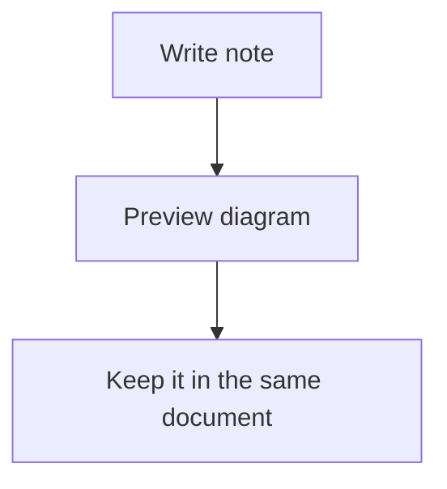

# Mermaid

Use Mermaid when a diagram explains something faster than a paragraph. It is a good fit for flows, simple architectures, state changes, timelines, and other structured visual notes.

Mermaid diagrams are rendered directly inside your note from fenced markdown code blocks.

````md

````

- Write your diagram inside a fenced code block with the `mermaid` language.
- View it in **Live Preview** or **Preview** mode.
- Keep diagrams close to the surrounding note, so documentation and visuals stay together.

<script setup>
import { withBase } from 'vitepress'
</script>


