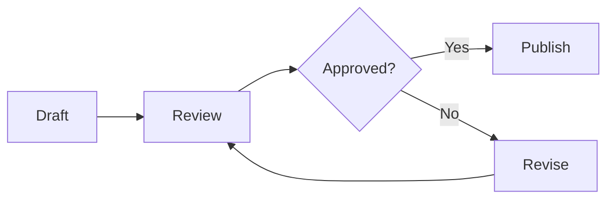

# Notes Fixture

A document for manually testing readability and markdown rendering in Note Space.

## 1. Basic Typography

A regular paragraph with **bold** text, *italic*, ~~strikethrough~~ and `inline code`.

A slightly longer second paragraph to verify vertical rhythm, line wrapping, and overall reading comfort in a longer document.

### Lists

- First item
- Second item with `inline code` and a [link](https://masscode.io)
- Third item

1. First step
2. Second step
3. Third step

### Task list

- [x] Prepare content
- [ ] Check light theme
- [ ] Check dark theme

## 2. Blockquotes and Dividers

> This is a blockquote.
> It should have a clean background, proper padding, and readable contrast.
>
> A third line to test multi-line blocks.

### Callouts

> [!NOTE]
> Highlights information that users should take into account, even when skimming.

> [!IMPORTANT]
> Crucial information necessary for users to succeed.

> [!WARNING]
> Critical content demanding immediate user attention due to potential risks.

---

## 3. Fenced code: TypeScript

```ts
interface User {
  id: number
  name: string
  roles: string[]
}

function formatUser(user: User): string {
  return `${user.id}: ${user.name} [${user.roles.join(', ')}]`
}
```

## 4. Fenced code: ASCII Tree (line-height check)

```text
components/tools/banner-maker/
├── Index.vue                # Main coordinator
├── composables/
│   ├── useKonvaStage.ts
│   ├── useSelection.ts
│   ├── useTools.ts
│   └── useSnapGuides.ts
├── components/
│   ├── controls/
│   │   ├── Toolbar.vue
│   │   └── ArrangeControls.vue
│   └── settings/
│       ├── ImageSettings.vue
│       └── SizeSettings.vue
└── constants/
    └── index.ts
```

## 5. Table

| Entity  | Purpose          | Status |
|---------|------------------|--------|
| Notes   | Text notes       | Active |
| Folders | Grouping         | Active |
| Tags    | Filtering        | Active |

## 6. Mermaid



## 7. Links

- https://github.com/massCodeIO/massCode
- <https://masscode.io>
- [Documentation](https://masscode.io/docs)
